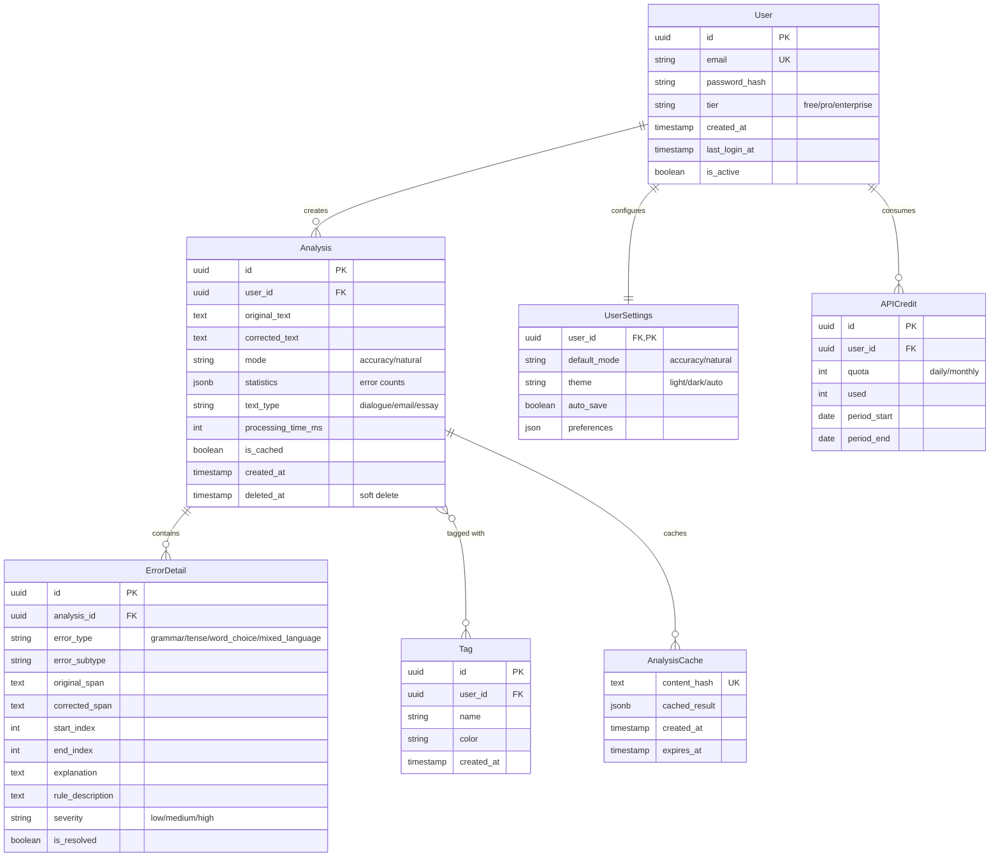
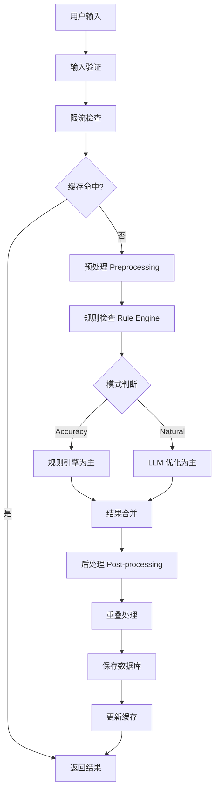

# English Transfer Assistant - 详细开发实施规范 (优化版 v2.0)

**文档版本**: v2.0
**状态**: 待开发
**最后更新**: 2026-01-20
**优化内容**: 完善索引设计、API规范、Pipeline架构、安全性、性能优化

本文档提供**生产级别**的开发指导，涵盖数据库设计、API接口、核心业务流程、性能优化、安全策略及监控方案。

---

## 目录

1. [数据库设计](#1-数据库设计-database-schema)
2. [API接口规范](#2-api接口规范-api-specification)
3. [核心功能内部逻辑](#3-核心功能内部逻辑-internal-logic)
4. [缓存与性能优化](#4-缓存与性能优化-caching--performance)
5. [安全策略](#5-安全策略-security)
6. [监控与日志](#6-监控与日志-monitoring--logging)
7. [错误处理策略](#7-错误处理策略-error-handling)
8. [开发检查清单](#8-开发检查清单-development-checklist)

---

## 1. 数据库设计 (Database Schema)

### 1.1 ER 图 (Entity-Relationship Diagram)



### 1.2 SQLAlchemy 模型定义（优化版）

#### `models/base.py` - 基础模型

```python
from sqlalchemy import Column, DateTime, Boolean
from sqlalchemy.ext.declarative import declarative_base
from datetime import datetime

Base = declarative_base()

class TimestampMixin:
    """时间戳混入类"""
    created_at = Column(DateTime, default=datetime.utcnow, nullable=False)
    updated_at = Column(DateTime, default=datetime.utcnow, onupdate=datetime.utcnow)

class SoftDeleteMixin:
    """软删除混入类"""
    deleted_at = Column(DateTime, nullable=True, index=True)
    is_deleted = Column(Boolean, default=False, index=True)

    def soft_delete(self):
        self.is_deleted = True
        self.deleted_at = datetime.utcnow()
```

#### `models/user.py` - 用户模型

```python
from sqlalchemy import Column, String, Boolean, ForeignKey, Index
from sqlalchemy.dialects.postgresql import UUID, JSONB
from sqlalchemy.orm import relationship, validates
from datetime import datetime
import uuid
from .base import Base, TimestampMixin

class User(Base, TimestampMixin):
    __tablename__ = "users"

    # 主键
    id = Column(UUID(as_uuid=True), primary_key=True, default=uuid.uuid4)

    # 认证信息
    email = Column(String(255), unique=True, nullable=False, index=True)
    password_hash = Column(String(255), nullable=False)

    # 订阅层级
    tier = Column(String(50), default="free", nullable=False)  # free, pro, enterprise

    # 账户状态
    is_active = Column(Boolean, default=True, nullable=False)
    is_verified = Column(Boolean, default=False, nullable=False)  # 邮箱验证
    last_login_at = Column(DateTime, nullable=True)

    # 关系
    settings = relationship(
        "UserSettings",
        back_populates="user",
        uselist=False,
        cascade="all, delete-orphan",
        lazy="joined"
    )
    analyses = relationship(
        "Analysis",
        back_populates="user",
        cascade="all, delete-orphan",
        lazy="dynamic",
        order_by="desc(Analysis.created_at)"
    )
    api_credits = relationship(
        "APICredit",
        back_populates="user",
        cascade="all, delete-orphan",
        order_by="desc(APICredit.period_start)"
    )

    # 索引
    __table_args__ = (
        Index('ix_users_tier_active', 'tier', 'is_active'),
        Index('ix_users_last_login', 'last_login_at'),
    )

    @validates('email')
    def validate_email(self, key, email):
        if not email or '@' not in email:
            raise ValueError("Invalid email address")
        return email.lower().strip()

class UserSettings(Base):
    """用户设置 - 一对一关系"""
    __tablename__ = "user_settings"

    user_id = Column(
        UUID(as_uuid=True),
        ForeignKey("users.id", ondelete="CASCADE"),
        primary_key=True
    )

    # 默认配置
    default_mode = Column(String(50), default="accuracy", nullable=False)
    theme = Column(String(50), default="light", nullable=False)
    auto_save = Column(Boolean, default=True, nullable=False)

    # 扩展配置（JSONB 存储个性化设置）
    preferences = Column(JSONB, default=dict)

    # 关系
    user = relationship("User", back_populates="settings")

class APICredit(Base):
    """API 配额管理"""
    __tablename__ = "api_credits"

    id = Column(UUID(as_uuid=True), primary_key=True, default=uuid.uuid4)
    user_id = Column(
        UUID(as_uuid=True),
        ForeignKey("users.id", ondelete="CASCADE"),
        nullable=False,
        index=True
    )

    # 配额类型
    quota_type = Column(String(50), nullable=False)  # daily, monthly
    quota = Column(Integer, nullable=False)  # 总配额
    used = Column(Integer, default=0, nullable=False)  # 已使用

    # 时间范围
    period_start = Column(DateTime, nullable=False)
    period_end = Column(DateTime, nullable=False)

    # 元数据
    metadata = Column(JSONB, default=dict)

    # 索引
    __table_args__ = (
        Index('ix_credits_user_period', 'user_id', 'period_start', 'period_end'),
        Index('ix_credits_type_period', 'quota_type', 'period_start', 'period_end'),
    )

    @property
    def remaining(self) -> int:
        return max(0, self.quota - self.used)

    @property
    def is_exceeded(self) -> bool:
        return self.used >= self.quota
```

#### `models/analysis.py` - 分析模型

```python
from sqlalchemy import Column, String, Text, Integer, String, ForeignKey, JSONB, Index, Boolean
from sqlalchemy.dialects.postgresql import UUID
from sqlalchemy.orm import relationship, validates
from datetime import datetime
import uuid
from .base import Base, TimestampMixin, SoftDeleteMixin

class Analysis(Base, TimestampMixin, SoftDeleteMixin):
    """文本分析记录"""
    __tablename__ = "analyses"

    # 主键
    id = Column(UUID(as_uuid=True), primary_key=True, default=uuid.uuid4)

    # 用户关联（nullable 用于匿名用户 - 见下文处理策略）
    user_id = Column(
        UUID(as_uuid=True),
        ForeignKey("users.id", ondelete="SET NULL"),
        nullable=True,
        index=True
    )

    # 文本内容
    original_text = Column(Text, nullable=False)
    corrected_text = Column(Text, nullable=False)

    # 分析参数
    mode = Column(String(50), nullable=False)  # accuracy, natural
    text_type = Column(String(50), default="unknown")  # dialogue, email, essay, sentence

    # 统计信息（JSONB 存储避免频繁 JOIN）
    # 格式: {"total": 5, "by_type": {"grammar": 2, "tense": 3}}
    statistics = Column(JSONB, default=dict, nullable=False)

    # 性能指标
    processing_time_ms = Column(Integer, default=0)
    is_cached = Column(Boolean, default=False)  # 是否命中缓存

    # 关系
    user = relationship("User", back_populates="analyses")
    errors = relationship(
        "ErrorDetail",
        back_populates="analysis",
        cascade="all, delete-orphan",
        lazy="dynamic",
        order_by="ErrorDetail.start_index"
    )
    tags = relationship(
        "AnalysisTag",
        back_populates="analysis",
        cascade="all, delete-orphan"
    )

    # 复合索引 - 优化常见查询
    __table_args__ = (
        Index('ix_analysis_user_date', 'user_id', 'created_at'),
        Index('ix_analysis_user_deleted', 'user_id', 'is_deleted', 'created_at'),
        Index('ix_analysis_mode_type', 'mode', 'text_type'),
        Index('ix_analysis_cache', 'is_cached', 'created_at'),
    )

    @validates('mode')
    def validate_mode(self, key, mode):
        if mode not in ['accuracy', 'natural']:
            raise ValueError("Mode must be 'accuracy' or 'natural'")
        return mode

class ErrorDetail(Base):
    """错误详情"""
    __tablename__ = "error_details"

    id = Column(UUID(as_uuid=True), primary_key=True, default=uuid.uuid4)
    analysis_id = Column(
        UUID(as_uuid=True),
        ForeignKey("analyses.id", ondelete="CASCADE"),
        nullable=False,
        index=True
    )

    # 错误分类
    error_type = Column(String(50), nullable=False, index=True)  # 主要类型
    error_subtype = Column(String(100))  # 子类型（如 past_tense）

    # 错误内容
    original_span = Column(String(500), nullable=False)
    corrected_span = Column(String(500), nullable=False)

    # 位置信息（基于 original_text 的字符索引，0-based）
    start_index = Column(Integer, nullable=False)
    end_index = Column(Integer, nullable=False)

    # 解释和规则
    explanation = Column(Text)
    rule_description = Column(Text)

    # 严重程度
    severity = Column(String(20), default="medium")  # low, medium, high
    is_resolved = Column(Boolean, default=False)  # 用户是否标记为已解决

    # 关系
    analysis = relationship("Analysis", back_populates="errors")

    # 索引
    __table_args__ = (
        Index('ix_error_analysis_severity', 'analysis_id', 'severity'),
        Index('ix_error_type', 'error_type', 'error_subtype'),
    )

    @property
    def position(self) -> dict:
        """返回位置信息字典"""
        return {"start": self.start_index, "end": self.end_index}

class Tag(Base):
    """用户自定义标签"""
    __tablename__ = "tags"

    id = Column(UUID(as_uuid=True), primary_key=True, default=uuid.uuid4)
    user_id = Column(
        UUID(as_uuid=True),
        ForeignKey("users.id", ondelete="CASCADE"),
        nullable=False,
        index=True
    )

    name = Column(String(100), nullable=False)
    color = Column(String(20), default="blue")  # UI 颜色
    description = Column(String(500))

    # 关系
    analyses = relationship("AnalysisTag", back_populates="tag", cascade="all, delete-orphan")

class AnalysisTag(Base):
    """分析-标签多对多关系"""
    __tablename__ = "analysis_tags"

    analysis_id = Column(
        UUID(as_uuid=True),
        ForeignKey("analyses.id", ondelete="CASCADE"),
        primary_key=True
    )
    tag_id = Column(
        UUID(as_uuid=True),
        ForeignKey("tags.id", ondelete="CASCADE"),
        primary_key=True
    )
    created_at = Column(DateTime, default=datetime.utcnow)

    # 关系
    analysis = relationship("Analysis", back_populates="tags")
    tag = relationship("Tag", back_populates="analyses")

class AnalysisCache(Base):
    """分析结果缓存（基于内容哈希）"""
    __tablename__ = "analysis_cache"

    content_hash = Column(String(64), primary_key=True)  # SHA-256 hash
    cached_result = Column(JSONB, nullable=False)
    created_at = Column(DateTime, default=datetime.utcnow, nullable=False)
    expires_at = Column(DateTime, nullable=False, index=True)

    # 索引
    __table_args__ = (
        Index('ix_cache_expires', 'expires_at'),
    )

    @property
    def is_valid(self) -> bool:
        return datetime.utcnow() < self.expires_at
```

### 1.3 匿名用户处理策略

**策略 1: 为匿名用户创建临时用户记录**

```python
# services/anonymous_service.py
class AnonymousUserService:
    """匿名用户管理服务"""

    async def create_or_get_anonymous(self, request: Request) -> User:
        """基于 session/fingerprint 创建或获取匿名用户"""

        # 从 cookie 获取匿名用户 ID
        anon_id = request.cookies.get("anon_user_id")

        if anon_id:
            user = await db.query(User).filter_by(id=anon_id).first()
            if user:
                return user

        # 创建新的匿名用户
        user = User(
            id=uuid.uuid4(),
            email=f"anon_{uuid.uuid4().hex}@temp.local",  # 临时邮箱
            password_hash="",  # 无密码
            tier="anonymous",
            is_active=True,
            is_verified=True
        )
        db.add(user)
        await db.commit()

        # 设置 cookie（30 天过期）
        # 在 response 中设置: Set-Cookie: anon_user_id={user.id}; Max-Age=2592000

        return user

    async def convert_to_registered(
        self,
        anon_user: User,
        email: str,
        password: str
    ) -> User:
        """匿名用户转注册用户"""

        # 更新用户信息
        anon_user.email = email
        anon_user.password_hash = hash_password(password)
        anon_user.tier = "free"

        # 迁移所有分析记录（不需要，因为 user_id 已存在）

        await db.commit()
        return anon_user
```

**优点**:
- 数据模型统一，无需 nullable user_id
- 匿名转注册无缝迁移历史记录
- 方便统计和限流

**缺点**:
- 会产生大量临时用户记录
- 需要定期清理（定时任务删除 30 天未登录的匿名用户）

---

### 1.4 数据库迁移脚本

```python
# alembic/versions/001_initial.py
from alembic import op
import sqlalchemy as sa
from sqlalchemy.dialects import postgresql

def upgrade():
    # 用户表
    op.create_table(
        'users',
        sa.Column('id', postgresql.UUID(as_uuid=True), primary_key=True),
        sa.Column('email', sa.String(255), nullable=False),
        sa.Column('password_hash', sa.String(255), nullable=False),
        sa.Column('tier', sa.String(50), nullable=False, server_default='free'),
        sa.Column('is_active', sa.Boolean(), nullable=False, server_default='true'),
        sa.Column('is_verified', sa.Boolean(), nullable=False, server_default='false'),
        sa.Column('created_at', sa.DateTime(), nullable=False, server_default=sa.func.now()),
        sa.Column('updated_at', sa.DateTime(), nullable=False, server_default=sa.func.now()),
        sa.Column('last_login_at', sa.DateTime(), nullable=True),
    )
    op.create_index('ix_users_email', 'users', ['email'], unique=True)
    op.create_index('ix_users_tier_active', 'users', ['tier', 'is_active'])
    op.create_index('ix_users_last_login', 'users', ['last_login_at'])

    # 分析表
    op.create_table(
        'analyses',
        sa.Column('id', postgresql.UUID(as_uuid=True), primary_key=True),
        sa.Column('user_id', postgresql.UUID(as_uuid=True), nullable=True),
        sa.Column('original_text', sa.Text(), nullable=False),
        sa.Column('corrected_text', sa.Text(), nullable=False),
        sa.Column('mode', sa.String(50), nullable=False),
        sa.Column('text_type', sa.String(50), nullable=False, server_default='unknown'),
        sa.Column('statistics', postgresql.JSONB(), nullable=False, server_default='{}'),
        sa.Column('processing_time_ms', sa.Integer(), nullable=False, server_default=0),
        sa.Column('is_cached', sa.Boolean(), nullable=False, server_default='false'),
        sa.Column('created_at', sa.DateTime(), nullable=False, server_default=sa.func.now()),
        sa.Column('updated_at', sa.DateTime(), nullable=False, server_default=sa.func.now()),
        sa.Column('deleted_at', sa.DateTime(), nullable=True),
        sa.Column('is_deleted', sa.Boolean(), nullable=False, server_default='false'),
        sa.ForeignKeyConstraint(['user_id'], ['users.id'], ondelete='SET NULL'),
    )
    op.create_index('ix_analysis_user_date', 'analyses', ['user_id', 'created_at'])
    op.create_index('ix_analysis_user_deleted', 'analyses', ['user_id', 'is_deleted', 'created_at'])
    op.create_index('ix_analysis_mode_type', 'analyses', ['mode', 'text_type'])
    op.create_index('ix_analysis_deleted', 'analyses', ['is_deleted'])
    op.create_index('ix_analysis_deleted_at', 'analyses', ['deleted_at'])

    # ... 其他表

    # 定时清理函数
    op.execute("""
        CREATE OR REPLACE FUNCTION cleanup_old_data()
        RETURNS void AS $$
        BEGIN
            -- 删除 30 天前的匿名用户数据
            DELETE FROM analyses
            WHERE user_id IN (
                SELECT id FROM users
                WHERE email LIKE 'anon_%@temp.local'
                AND last_login_at < NOW() - INTERVAL '30 days'
            );

            -- 删除过期缓存
            DELETE FROM analysis_cache
            WHERE expires_at < NOW();

            -- 删除软删除超过 90 天的记录
            DELETE FROM analyses
            WHERE is_deleted = true
            AND deleted_at < NOW() - INTERVAL '90 days';
        END;
        $$ LANGUAGE plpgsql;
    """)

def downgrade():
    op.drop_table('analyses')
    op.drop_table('users')
```

---

## 2. API接口规范 (API Specification)

**基础 URL**: `/api/v1`
**认证方式**: JWT Bearer Token (Header: `Authorization: Bearer <token>`)
**响应格式**: JSON
**错误格式**: 统一结构（见第 7 节）

### 2.1 认证模块 (Auth)

#### POST /auth/register - 用户注册

**请求**:
```http
POST /api/v1/auth/register
Content-Type: application/json

{
  "email": "user@example.com",
  "password": "SecurePass123!"
}
```

**验证规则**:
- `email`: 有效邮箱格式，唯一，小写存储
- `password`: 最小 8 字符，必须包含大小写字母、数字

**成功响应 (201 Created)**:
```json
{
  "success": true,
  "data": {
    "access_token": "eyJhbGciOiJIUzI1NiIs...",
    "refresh_token": "eyJhbGciOiJIUzI1NiIs...",
    "token_type": "Bearer",
    "expires_in": 3600,
    "user": {
      "id": "uuid-here",
      "email": "user@example.com",
      "tier": "free",
      "is_verified": false,
      "created_at": "2026-01-20T10:00:00Z"
    }
  }
}
```

**错误响应**:
- `400 INVALID_EMAIL`: 邮箱格式无效
- `400 WEAK_PASSWORD`: 密码强度不足
- `409 EMAIL_EXISTS`: 邮箱已被注册

---

#### POST /auth/login - 用户登录

**请求**:
```http
POST /api/v1/auth/login
Content-Type: application/json

{
  "email": "user@example.com",
  "password": "SecurePass123!"
}
```

**成功响应 (200 OK)**: 同注册响应

**错误响应**:
- `400 INVALID_CREDENTIALS`: 邮箱或密码错误
- `403 ACCOUNT_DISABLED`: 账户已被禁用
- `429 TOO_MANY_ATTEMPTS`: 登录尝试过多（15 分钟内 5 次）

---

#### POST /auth/refresh - 刷新令牌

**请求**:
```http
POST /api/v1/auth/refresh
Content-Type: application/json

{
  "refresh_token": "eyJhbGciOiJIUzI1NiIs..."
}
```

**成功响应 (200 OK)**:
```json
{
  "success": true,
  "data": {
    "access_token": "eyJhbGciOiJIUzI1NiIs...",
    "expires_in": 3600
  }
}
```

**错误响应**:
- `401 INVALID_TOKEN`: Refresh token 无效或过期

---

#### GET /auth/me - 获取当前用户信息

**请求**:
```http
GET /api/v1/auth/me
Authorization: Bearer <access_token>
```

**成功响应 (200 OK)**:
```json
{
  "success": true,
  "data": {
    "user": {
      "id": "uuid",
      "email": "user@example.com",
      "tier": "free",
      "is_verified": true,
      "created_at": "2026-01-20T10:00:00Z",
      "settings": {
        "default_mode": "accuracy",
        "theme": "light",
        "auto_save": true,
        "preferences": {}
      },
      "credits": {
        "daily": {
          "quota": 50,
          "used": 5,
          "remaining": 45,
          "resets_at": "2026-01-21T00:00:00Z"
        }
      }
    }
  }
}
```

---

### 2.2 核心业务模块 (Core)

#### POST /analyze - 文本分析

**请求**:
```http
POST /api/v1/analyze
Authorization: Bearer <token> (可选，匿名用户有限流)
Content-Type: application/json

{
  "text": "I go to school yesterday. And I very like it.",
  "mode": "accuracy",
  "options": {
    "detect_chinese": true,
    "preserve_proper_nouns": true
  }
}
```

**验证规则**:
- `text`: 1-5000 字符，必须包含英文字母，去除控制字符
- `mode`: "accuracy" 或 "natural"
- `options.detect_chinese`: boolean (默认 true)
- `options.preserve_proper_nouns`: boolean (默认 true)

**处理流程**:
1. **输入验证**: Pydantic 验证 + 控制字符过滤
2. **限流检查**: 检查用户配额
3. **缓存查询**: 基于 `{text}:{mode}` 的哈希查询缓存
4. **Pipeline 处理**: 预处理 → 规则检查 → LLM 优化 → 后处理
5. **结果存储**: 保存到数据库
6. **配额扣减**: 更新 API 使用量

**成功响应 (200 OK)**:
```json
{
  "success": true,
  "data": {
    "id": "analysis-uuid",
    "original_text": "I go to school yesterday. And I very like it.",
    "corrected_text": "I went to school yesterday. And I really liked it.",
    "text_type": "sentence",
    "mode": "accuracy",
    "is_cached": false,
    "processing_time_ms": 1234,
    "statistics": {
      "total_errors": 2,
      "by_type": {
        "tense": 1,
        "chinglish": 1
      }
    },
    "errors": [
      {
        "id": "err-001",
        "type": "tense",
        "subtype": "past_tense",
        "original": "go",
        "correction": "went",
        "position": {
          "start": 2,
          "end": 4
        },
        "explanation": "过去发生的事情应该使用过去式。不规则动词 go 的过去式是 went。",
        "severity": "high"
      },
      {
        "id": "err-002",
        "type": "chinglish",
        "subtype": "literal_translation",
        "original": "very like",
        "correction": "really liked",
        "position": {
          "start": 26,
          "end": 35
        },
        "explanation": "中文的'很喜欢'通常翻译为 'really like/like really much'，而不是 'very like'。",
        "severity": "medium"
      }
    ],
    "learning_tips": [
      "注意区分一般过去时的动词变化 (go → went)",
      "避免直译中文习惯用语 (very like → really like)"
    ],
    "created_at": "2026-01-20T10:05:00Z"
  }
}
```

**错误响应**:
- `400 TEXT_TOO_SHORT`: 文本少于 1 字符
- `400 TEXT_TOO_LONG`: 文本超过 5000 字符
- `400 TEXT_NO_ENGLISH`: 未检测到英文字母
- `400 INVALID_MODE`: mode 参数无效
- `429 QUOTA_EXCEEDED`: 超出配额
  - Header: `Retry-After: 3600`
  - Header: `X-Quota-Limit: 50`
  - Header: `X-Quota-Used: 50`
  - Header: `X-Quota-Remaining: 0`
- `500 ANALYSIS_FAILED`: 分析失败
- `500 LLM_ERROR`: LLM 服务错误
- `500 GRAMMAR_TOOL_ERROR`: 语法检查工具错误

---

#### POST /export - 导出分析结果

**请求**:
```http
POST /api/v1/export
Authorization: Bearer <token>
Content-Type: application/json

{
  "analysis_ids": ["uuid-1", "uuid-2"],
  "format": "markdown",
  "options": {
    "include_explanations": true,
    "include_learning_tips": true
  }
}
```

**验证规则**:
- `analysis_ids`: 1-100 个 UUID
- `format`: "json", "markdown", "pdf"
- 权限验证: 用户只能导出自己的分析

**成功响应 (200 OK)**:
- JSON/Markdown: `Content-Type: application/json` 或 `text/markdown`
- PDF: `Content-Type: application/pdf`
- Header: `Content-Disposition: attachment; filename="correction_notes_20260120.md"`

**错误响应**:
- `400 INVALID_FORMAT`: 格式不支持
- `400 TOO_MANY_IDS`: 超过 100 个 ID
- `403 PERMISSION_DENIED`: 无权限导出某些分析

---

### 2.3 历史与统计 (History & Statistics)

#### GET /history - 获取历史列表

**请求**:
```http
GET /api/v1/history?page=1&limit=20&mode=accuracy&text_type=dialogue
Authorization: Bearer <token>
```

**查询参数**:
- `page`: 页码（默认 1，最小 1）
- `limit`: 每页数量（默认 20，范围 1-100）
- `mode`: 筛选模式（可选）
- `text_type`: 筛选文本类型（可选）
- `sort`: 排序字段（默认 `created_at`，可选 `processing_time`）
- `order`: 排序方向（默认 `desc`，可选 `asc`）

**成功响应 (200 OK)**:
```json
{
  "success": true,
  "data": {
    "items": [
      {
        "id": "uuid",
        "original_text": "I go to school...",
        "corrected_text": "I went to school...",
        "mode": "accuracy",
        "text_type": "sentence",
        "error_count": 2,
        "created_at": "2026-01-20T10:00:00Z"
      }
    ],
    "pagination": {
      "total": 150,
      "page": 1,
      "limit": 20,
      "pages": 8,
      "has_next": true,
      "has_prev": false
    }
  }
}
```

---

#### GET /history/{id} - 获取历史详情

**请求**:
```http
GET /api/v1/history/{analysis_id}
Authorization: Bearer <token>
```

**成功响应 (200 OK)**: 完整的分析对象（同 `/analyze` 响应）

**错误响应**:
- `404 NOT_FOUND`: 分析不存在或无权限访问

---

#### DELETE /history/{id} - 删除历史记录

**请求**:
```http
DELETE /api/v1/history/{analysis_id}
Authorization: Bearer <token>
```

**成功响应 (204 No Content)**: 无响应体

**错误响应**:
- `404 NOT_FOUND`: 分析不存在
- `403 PERMISSION_DENIED`: 无权限删除

---

#### GET /statistics/overview - 统计概览

**请求**:
```http
GET /api/v1/statistics/overview?period=7d
Authorization: Bearer <token>
```

**查询参数**:
- `period`: 时间范围（默认 `7d`，可选 `1d`, `7d`, `30d`, `all`）

**成功响应 (200 OK)**:
```json
{
  "success": true,
  "data": {
    "period": "7d",
    "total_analyses": 100,
    "total_errors": 350,
    "average_errors_per_analysis": 3.5,
    "error_distribution": {
      "grammar": 140,
      "tense": 105,
      "word_choice": 70,
      "mixed_language": 35
    },
    "top_errors": [
      {
        "type": "tense",
        "subtype": "past_tense",
        "count": 89,
        "percentage": 25.4
      },
      {
        "type": "chinglish",
        "subtype": "literal_translation",
        "count": 45,
        "percentage": 12.9
      }
    ],
    "improvement_trend": {
      "this_week": {
        "total_analyses": 50,
        "total_errors": 150,
        "avg_per_analysis": 3.0
      },
      "last_week": {
        "total_analyses": 40,
        "total_errors": 160,
        "avg_per_analysis": 4.0
      },
      "improvement_rate": -25.0
    },
    "daily_trend": [
      {
        "date": "2026-01-14",
        "analyses": 10,
        "errors": 35
      },
      {
        "date": "2026-01-15",
        "analyses": 15,
        "errors": 45
      }
    ]
  }
}
```

**性能优化**:
- 优先从 Redis 缓存读取（TTL 1 小时）
- 缓存键: `stats:user:{user_id}:{period}`
- 缓存失效: 每次分析后异步更新

---

### 2.4 用户设置模块 (Settings)

#### GET /settings - 获取用户设置

**请求**:
```http
GET /api/v1/settings
Authorization: Bearer <token>
```

**成功响应 (200 OK)**:
```json
{
  "success": true,
  "data": {
    "default_mode": "accuracy",
    "theme": "light",
    "auto_save": true,
    "preferences": {
      "notifications_enabled": true,
      "email_summary": "weekly"
    }
  }
}
```

---

#### PUT /settings - 更新用户设置

**请求**:
```http
PUT /api/v1/settings
Authorization: Bearer <token>
Content-Type: application/json

{
  "default_mode": "natural",
  "theme": "dark"
}
```

**成功响应 (200 OK)**: 更新后的设置对象

---

## 3. 核心功能内部逻辑 (Internal Logic)

### 3.1 文本分析流水线 (Analysis Pipeline)

**架构图**:


---

#### 3.1.1 预处理模块 (Preprocessor)

```python
# pipeline/preprocessor.py
import re
import nltk
from typing import List, Dict
from dataclasses import dataclass

@dataclass
class PreprocessedText:
    """预处理结果"""
    original: str
    cleaned: str
    sentences: List[str]
    has_chinese: bool
    chinese_ratio: float
    detected_speakers: List[str]

class Preprocessor:
    def __init__(self):
        # 下载 NLTK 数据
        try:
            nltk.data.find('tokenizers/punkt')
        except LookupError:
            nltk.download('punkt')

    async def process(self, text: str) -> PreprocessedText:
        """预处理文本"""

        # 1. 基础清理
        cleaned = self._clean_text(text)

        # 2. 语言检测
        has_chinese, chinese_ratio = self._detect_chinese(cleaned)

        # 3. 英文验证
        if not self._has_english(cleaned):
            raise ValueError("Text must contain English characters")

        # 4. 分句
        sentences = self._split_sentences(cleaned)

        # 5. 说话人识别（可选）
        detected_speakers = self._detect_speakers(cleaned)

        return PreprocessedText(
            original=text,
            cleaned=cleaned,
            sentences=sentences,
            has_chinese=has_chinese,
            chinese_ratio=chinese_ratio,
            detected_speakers=detected_speakers
        )

    def _clean_text(self, text: str) -> str:
        """清理文本"""
        # 去除控制字符（保留换行符）
        text = re.sub(r'[\x00-\x08\x0b-\x0c\x0e-\x1f\x7f]', '', text)

        # 规范化空白字符
        text = re.sub(r'[ \t]+', ' ', text)  # 多个空格合并
        text = re.sub(r'\n{3,}', '\n\n', text)  # 多个换行合并

        return text.strip()

    def _detect_chinese(self, text: str) -> tuple[bool, float]:
        """检测中文字符"""
        chinese_chars = re.findall(r'[\u4e00-\u9fff]', text)
        total_chars = len(re.sub(r'\s', '', text))

        if total_chars == 0:
            return False, 0.0

        ratio = len(chinese_chars) / total_chars
        return len(chinese_chars) > 0, ratio

    def _has_english(self, text: str) -> bool:
        """检查是否包含英文"""
        return bool(re.search(r'[a-zA-Z]{2,}', text))

    def _split_sentences(self, text: str) -> List[str]:
        """分句"""
        # 使用 NLTK 的 sentence tokenizer
        sentences = nltk.sent_tokenize(text)

        # 清理每个句子
        sentences = [s.strip() for s in sentences if s.strip()]

        return sentences

    def _detect_speakers(self, text: str) -> List[str]:
        """检测说话人标识"""
        # 常见说话人模式: "A:", "B:", "Tom:", "Alice:"
        patterns = [
            r'^([A-Z]):\s',
            r'^([A-Z][a-z]+):\s',
            r'^([A-Z][a-z]+\s[A-Z][a-z]+):\s'
        ]

        speakers = set()
        for line in text.split('\n'):
            for pattern in patterns:
                match = re.match(pattern, line.strip())
                if match:
                    speakers.add(match.group(1))

        return sorted(list(speakers))
```

---

#### 3.1.2 规则检查模块 (Rule Engine)

```python
# pipeline/rule_engine.py
import language_tool_python
from typing import List, Dict
from dataclasses import dataclass

@dataclass
class GrammarError:
    """语法错误"""
    rule_id: str
    message: str
    category: str
    original: str
    suggestions: List[str]
    start: int
    end: int
    severity: str  # low, medium, high

class RuleEngine:
    def __init__(self):
        self.tool = language_tool_python.LanguageTool('en-US')

        # 错误类型映射
        self.category_mapping = {
            'GRAMMAR': 'grammar',
            'TENSE': 'tense',
            'SPELLING': 'spelling',
            'TYPOS': 'word_choice',
            'WORD': 'word_choice',
            'STYLE': 'style',
            'PUNCTUATION': 'punctuation'
        }

    async def check(self, text: str) -> List[GrammarError]:
        """检查语法错误"""

        # 调用 LanguageTool
        matches = self.tool.check(text)

        errors = []
        for match in matches:
            error = GrammarError(
                rule_id=match.ruleId,
                message=match.message,
                category=self._map_category(match),
                original=text[match.offset:match.offset + match.errorLength],
                suggestions=match.replacements[:3],  # 最多 3 个建议
                start=match.offset,
                end=match.offset + match.errorLength,
                severity=self._assess_severity(match)
            )
            errors.append(error)

        return errors

    def _map_category(self, match) -> str:
        """映射错误类型"""
        category = match.category or ''
        rule_id = match.ruleId or ''

        # 优先从 rule_id 判断
        if 'TENSE' in rule_id.upper():
            return 'tense'
        if 'VERB' in rule_id.upper():
            return 'tense'

        # 从 category 判断
        for key, value in self.category_mapping.items():
            if key in category.upper():
                return value

        return 'grammar'  # 默认

    def _assess_severity(self, match) -> str:
        """评估严重程度"""
        # 拼写错误通常严重程度低
        if 'TYPOS' in match.category or 'SPELLING' in match.category:
            return 'low'

        # 时态、语法错误严重程度高
        if 'TENSE' in match.ruleId or 'GRAMMAR' in match.category:
            return 'high'

        return 'medium'
```

---

#### 3.1.3 LLM 优化模块 (LLM Engine)

```python
# pipeline/llm_engine.py
import json
from zhipuai import ZhipuAI
from typing import Dict, List
from dataclasses import dataclass

@dataclass
class LLMResult:
    """LLM 处理结果"""
    corrected_text: str
    text_type: str  # dialogue, email, essay, sentence
    tone: str  # formal, informal, academic, business
    changes: List[Dict]

class LLMEngine:
    def __init__(self, api_key: str):
        self.client = ZhipuAI(api_key=api_key)

    async def optimize(
        self,
        text: str,
        mode: str,
        has_chinese: bool = False
    ) -> LLMResult:
        """使用 LLM 优化文本"""

        # 构建 prompt
        prompt = self._build_prompt(text, mode, has_chinese)

        try:
            response = self.client.chat.completions.create(
                model="glm-4-flash",
                messages=[
                    {
                        "role": "system",
                        "content": "You are an expert English writing assistant and language teacher."
                    },
                    {
                        "role": "user",
                        "content": prompt
                    }
                ],
                temperature=0.3,
                response_format={"type": "json_object"}  # 强制 JSON 输出
            )

            # 解析响应
            content = response.choices[0].message.content
            result_data = json.loads(content)

            # 验证必需字段
            self._validate_result(result_data)

            return LLMResult(
                corrected_text=result_data['corrected_text'],
                text_type=result_data.get('text_type', 'unknown'),
                tone=result_data.get('tone', 'neutral'),
                changes=result_data.get('changes', [])
            )

        except json.JSONDecodeError as e:
            # Fallback: 提取纯文本
            corrected_text = self._extract_text_from_failed_response(content)
            return LLMResult(
                corrected_text=corrected_text,
                text_type='unknown',
                tone='neutral',
                changes=[]
            )
        except Exception as e:
            # 记录错误并抛出
            raise LLMError(f"LLM processing failed: {str(e)}")

    def _build_prompt(self, text: str, mode: str, has_chinese: bool) -> str:
        """构建 prompt"""

        base_prompt = f"""You are an expert English writing assistant.

**Task**: Analyze and correct the following English text.

**Mode**: {mode}
- Accuracy Mode: Fix ONLY grammatical, spelling, and tense errors. Preserve the original style and structure.
- Natural Mode: Improve naturalness and flow. You may rephrase sentences to sound more native-like.

**Text to Analyze**:
\"\"\"{text}\"\"\"

**Requirements**:
1. Return a valid JSON object (no markdown formatting)
2. JSON Schema:
{{
  "corrected_text": "the full corrected text",
  "text_type": "dialogue|email|essay|sentence|mixed",
  "tone": "formal|informal|academic|business|neutral",
  "changes": [
    {{
      "original": "incorrect phrase",
      "corrected": "correct phrase",
      "explanation": "clear explanation of why this is wrong",
      "type": "grammar|tense|word_choice|mixed_language|style",
      "severity": "low|medium|high"
    }}
  ]
}}
"""

        # 如果包含中文，添加特殊说明
        if has_chinese:
            chinese_prompt = """

**Special Note**: The text contains Chinese characters.
- For Chinese-English mixing: Suggest appropriate English alternatives
- For Chinese text within: Provide translation if it makes sense in context
- Mark these changes with type: "mixed_language"
"""
            return base_prompt + chinese_prompt

        return base_prompt

    def _validate_result(self, result: dict):
        """验证 LLM 结果"""
        if 'corrected_text' not in result:
            raise ValueError("LLM response missing 'corrected_text' field")

        if not isinstance(result.get('changes'), list):
            raise ValueError("LLM 'changes' field must be a list")

    def _extract_text_from_failed_response(self, content: str) -> str:
        """从失败的响应中提取文本"""
        # 尝试提取 JSON
        json_match = re.search(r'\{.*\}', content, re.DOTALL)
        if json_match:
            try:
                data = json.loads(json_match.group())
                return data.get('corrected_text', content)
            except json.JSONDecodeError:
                pass

        # 返回原始内容（清理后）
        return content.strip('"\'')

class LLMError(Exception):
    """LLM 处理错误"""
    pass
```

---

#### 3.1.4 结果合并模块 (Merger)

```python
# pipeline/merger.py
from diff_match_patch import diff_match_patch
from typing import List, Dict
from dataclasses import dataclass

@dataclass
class MergedError:
    """合并后的错误"""
    id: str
    type: str
    subtype: str
    original: str
    correction: str
    position: dict
    explanation: str
    severity: str

class Merger:
    def __init__(self):
        self.dmp = diff_match_patch()

    async def merge(
        self,
        original_text: str,
        rule_errors: List[GrammarError],
        llm_result: LLMResult,
        mode: str
    ) -> Dict:
        """合并规则引擎和 LLM 结果"""

        if mode == 'accuracy':
            # Accuracy 模式：以规则引擎为主
            return await self._merge_accuracy_mode(
                original_text, rule_errors, llm_result
            )
        else:
            # Natural 模式：以 LLM 为主
            return await self._merge_natural_mode(
                original_text, rule_errors, llm_result
            )

    async def _merge_accuracy_mode(
        self,
        original_text: str,
        rule_errors: List[GrammarError],
        llm_result: LLMResult
    ) -> Dict:
        """合并 Accuracy 模式结果"""

        errors = []

        # 主要使用规则引擎的错误
        for idx, rule_error in enumerate(rule_errors):
            error = MergedError(
                id=f"err_{idx}",
                type=rule_error.category,
                subtype=rule_error.rule_id,
                original=rule_error.original,
                correction=rule_error.suggestions[0] if rule_error.suggestions else '',
                position={
                    "start": rule_error.start,
                    "end": rule_error.end
                },
                explanation=rule_error.message,
                severity=rule_error.severity
            )
            errors.append(error)

        # 使用 LLM 的 changes 补充规则引擎未捕获的语义错误
        llm_changes = llm_result.changes or []
        for change in llm_changes:
            # 检查是否已被规则引擎覆盖
            if not self._is_covered(change, rule_errors):
                # 使用 diff 查找位置
                position = self._find_change_position(
                    original_text,
                    change['original'],
                    change['correction']
                )

                if position:
                    error = MergedError(
                        id=f"llm_{len(errors)}",
                        type=change.get('type', 'grammar'),
                        subtype='llm_detected',
                        original=change['original'],
                        correction=change['correction'],
                        position=position,
                        explanation=change.get('explanation', ''),
                        severity=change.get('severity', 'medium')
                    )
                    errors.append(error)

        # 处理重叠
        errors = self._resolve_overlaps(errors)

        # 生成纠正后文本
        corrected_text = self._apply_corrections(original_text, errors)

        # 生成统计
        stats = self._generate_statistics(errors)

        return {
            "corrected_text": corrected_text,
            "errors": [self._to_dict(e) for e in errors],
            "statistics": stats,
            "text_type": llm_result.text_type
        }

    async def _merge_natural_mode(
        self,
        original_text: str,
        rule_errors: List[GrammarError],
        llm_result: LLMResult
    ) -> Dict:
        """合并 Natural 模式结果"""

        # 使用 diff 生成完整的变化列表
        diffs = self.dmp.diff_main(original_text, llm_result.corrected_text)
        self.dmp.diff_cleanupSemantic(diffs)

        errors = []

        # 从 LLM changes 生成错误
        llm_changes = llm_result.changes or []
        for idx, change in enumerate(llm_changes):
            # 查找位置（基于原文）
            position = self._find_change_position(
                original_text,
                change['original'],
                change['correction']
            )

            if position:
                error = MergedError(
                    id=f"llm_{idx}",
                    type=change.get('type', 'style'),
                    subtype='llm_suggested',
                    original=change['original'],
                    correction=change['correction'],
                    position=position,
                    explanation=change.get('explanation', ''),
                    severity=change.get('severity', 'low')
                )
                errors.append(error)

        # 补充规则引擎捕获的基础错误（如果 LLM 未修改）
        for rule_error in rule_errors:
            if not self._is_position_modified(
                rule_error.start, rule_error.end, errors
            ):
                error = MergedError(
                    id=f"rule_{len(errors)}",
                    type=rule_error.category,
                    subtype=rule_error.rule_id,
                    original=rule_error.original,
                    correction=rule_error.suggestions[0] if rule_error.suggestions else '',
                    position={
                        "start": rule_error.start,
                        "end": rule_error.end
                    },
                    explanation=rule_error.message,
                    severity=rule_error.severity
                )
                errors.append(error)

        # 处理重叠
        errors = self._resolve_overlaps(errors)

        # 生成统计
        stats = self._generate_statistics(errors)

        return {
            "corrected_text": llm_result.corrected_text,
            "errors": [self._to_dict(e) for e in errors],
            "statistics": stats,
            "text_type": llm_result.text_type
        }

    def _is_covered(
        self,
        llm_change: dict,
        rule_errors: List[GrammarError]
    ) -> bool:
        """检查 LLM change 是否已被规则引擎覆盖"""
        original = llm_change.get('original', '')

        for rule_error in rule_errors:
            if rule_error.original.lower() == original.lower():
                return True

        return False

    def _find_change_position(
        self,
        text: str,
        original: str,
        correction: str
    ) -> dict | None:
        """查找变化在原文中的位置"""

        # 简单查找（从左到右）
        start = text.find(original)
        if start == -1:
            return None

        end = start + len(original)

        return {"start": start, "end": end}

    def _resolve_overlaps(self, errors: List[MergedError]) -> List[MergedError]:
        """处理重叠的错误"""

        if not errors:
            return []

        # 按位置排序
        sorted_errors = sorted(
            errors,
            key=lambda e: (e.position['start'], e.position['end'])
        )

        merged = []
        for error in sorted_errors:
            if not merged:
                merged.append(error)
                continue

            last = merged[-1]

            # 检查是否重叠
            if (error.position['start'] < last.position['end'] and
                error.position['end'] > last.position['start']):

                # 选择范围更大的或严重程度更高的
                last_range = last.position['end'] - last.position['start']
                error_range = error.position['end'] - error.position['start']

                if error_range > last_range:
                    merged[-1] = error
                elif (error.severity == 'high' and
                      last.severity in ['low', 'medium']):
                    merged[-1] = error
                # 否则保留 last，忽略 error
            else:
                merged.append(error)

        return merged

    def _is_position_modified(
        self,
        start: int,
        end: int,
        errors: List[MergedError]
    ) -> bool:
        """检查位置是否已被修改"""
        for error in errors:
            if (start >= error.position['start'] and
                end <= error.position['end']):
                return True
        return False

    def _apply_corrections(
        self,
        text: str,
        errors: List[MergedError]
    ) -> str:
        """应用纠正生成新文本"""

        # 按位置倒序排序（从后往前修改，避免索引变化）
        sorted_errors = sorted(
            errors,
            key=lambda e: e.position['start'],
            reverse=True
        )

        result = text
        for error in sorted_errors:
            start = error.position['start']
            end = error.position['end']
            result = result[:start] + error.correction + result[end:]

        return result

    def _generate_statistics(self, errors: List[MergedError]) -> dict:
        """生成统计信息"""
        stats = {
            "total": len(errors),
            "by_type": {}
        }

        for error in errors:
            error_type = error.type
            stats["by_type"][error_type] = \
                stats["by_type"].get(error_type, 0) + 1

        return stats

    def _to_dict(self, error: MergedError) -> dict:
        """转换为字典"""
        return {
            "id": error.id,
            "type": error.type,
            "subtype": error.subtype,
            "original": error.original,
            "correction": error.correction,
            "position": error.position,
            "explanation": error.explanation,
            "severity": error.severity
        }
```

---

#### 3.1.5 Pipeline 主控制器

```python
# pipeline/pipeline.py
from .preprocessor import Preprocessor
from .rule_engine import RuleEngine
from .llm_engine import LLMEngine, LLMError
from .merger import Merger
from services.cache_service import CacheService

class AnalysisPipeline:
    """文本分析流水线"""

    def __init__(
        self,
        zhipu_api_key: str,
        cache_service: CacheService
    ):
        self.preprocessor = Preprocessor()
        self.rule_engine = RuleEngine()
        self.llm_engine = LLMEngine(zhipu_api_key)
        self.merger = Merger()
        self.cache = cache_service

    async def process(
        self,
        text: str,
        mode: str,
        user_id: str = None
    ) -> dict:
        """处理文本分析"""

        start_time = time.time()

        try:
            # 1. 预处理
            preprocessed = await self.preprocessor.process(text)

            # 2. 规则检查
            rule_errors = await self.rule_engine.check(preprocessed.cleaned)

            # 3. LLM 优化
            try:
                llm_result = await self.llm_engine.optimize(
                    preprocessed.cleaned,
                    mode,
                    preprocessed.has_chinese
                )
            except LLMError as e:
                # LLM 失败，降级到规则引擎
                logging.warning(f"LLM failed, using rule engine only: {e}")
                llm_result = self._create_fallback_llm_result(
                    preprocessed.cleaned, rule_errors
                )

            # 4. 结果合并
            result = await self.merger.merge(
                preprocessed.cleaned,
                rule_errors,
                llm_result,
                mode
            )

            # 5. 添加元数据
            result['processing_time_ms'] = int(
                (time.time() - start_time) * 1000
            )
            result['original_text'] = text

            # 6. 生成学习建议
            result['learning_tips'] = self._generate_learning_tips(
                result['errors'],
                result['statistics']
            )

            # 7. 缓存结果
            await self.cache.cache_analysis(text, mode, result)

            return result

        except Exception as e:
            logging.error(f"Pipeline processing failed: {e}")
            raise

    def _create_fallback_llm_result(self, text: str, errors: list) -> dict:
        """创建 fallback LLM 结果"""
        # 应用规则引擎的纠正
        corrections = []
        for error in errors:
            if error.suggestions:
                corrections.append({
                    'original': error.original,
                    'correction': error.suggestions[0],
                    'explanation': error.message,
                    'type': error.category,
                    'severity': error.severity
                })

        corrected_text = text
        for error in reversed(sorted(errors, key=lambda e: e.start)):
            if error.suggestions:
                corrected_text = (corrected_text[:error.start] +
                                error.suggestions[0] +
                                corrected_text[error.end:])

        return {
            'corrected_text': corrected_text,
            'text_type': 'unknown',
            'tone': 'neutral',
            'changes': corrections
        }

    def _generate_learning_tips(self, errors: list, stats: dict) -> list:
        """生成学习建议"""
        tips = []

        # 基于错误类型分布
        if stats['by_type'].get('tense', 0) > 0:
            tense_count = stats['by_type']['tense']
            percentage = (tense_count / stats['total']) * 100
            tips.append(
                f"时态错误占 {percentage:.1f}%，建议复习不规则动词表"
            )

        if stats['by_type'].get('mixed_language', 0) > 0:
            tips.append(
                "尽量避免中英混用，尝试用英语完整表达"
            )

        if stats['by_type'].get('chinglish', 0) > 0:
            tips.append(
                "注意避免直译中文表达，使用地道的英语短语"
            )

        return tips
```

---

## 4. 缓存与性能优化 (Caching & Performance)

### 4.1 多层缓存策略

```python
# services/cache_service.py
from redis import Redis
from hashlib import sha256
import json
from typing import Optional

class CacheService:
    """缓存服务"""

    def __init__(self, redis_client: Redis):
        self.redis = redis_client

    def _get_cache_key(self, text: str, mode: str) -> str:
        """生成缓存键"""
        content = f"{mode}:{text}"
        hash_value = sha256(content.encode()).hexdigest()
        return f"analysis:{hash_value}"

    async def get_cached_analysis(
        self,
        text: str,
        mode: str
    ) -> Optional[dict]:
        """获取缓存的分析结果"""
        key = self._get_cache_key(text, mode)
        cached = await self.redis.get(key)

        if cached:
            return json.loads(cached)
        return None

    async def cache_analysis(
        self,
        text: str,
        mode: str,
        result: dict,
        ttl: int = 86400  # 24 小时
    ):
        """缓存分析结果"""
        key = self._get_cache_key(text, mode)
        await self.redis.setex(
            key,
            ttl,
            json.dumps(result)
        )

    async def cache_user_stats(
        self,
        user_id: str,
        period: str,
        stats: dict,
        ttl: int = 3600  # 1 小时
    ):
        """缓存用户统计"""
        key = f"stats:user:{user_id}:{period}"
        await self.redis.setex(
            key,
            ttl,
            json.dumps(stats)
        )

    async def get_user_stats(
        self,
        user_id: str,
        period: str
    ) -> Optional[dict]:
        """获取缓存的用户统计"""
        key = f"stats:user:{user_id}:{period}"
        cached = await self.redis.get(key)

        if cached:
            return json.loads(cached)
        return None

    async def invalidate_user_stats(self, user_id: str):
        """使用户统计缓存失效"""
        pattern = f"stats:user:{user_id}:*"
        keys = await self.redis.keys(pattern)
        if keys:
            await self.redis.delete(*keys)
```

### 4.2 限流与配额管理

```python
# services/rate_limit_service.py
from redis import Redis
from datetime import datetime, timedelta

class RateLimitService:
    """限流服务"""

    # 配额配置
    QUOTA_CONFIG = {
        'anonymous': {'daily': 5, 'hourly': 2},
        'free': {'daily': 50, 'hourly': 10},
        'pro': {'daily': 500, 'hourly': 100},
        'enterprise': {'daily': 5000, 'hourly': 1000}
    }

    def __init__(self, redis_client: Redis):
        self.redis = redis_client

    async def check_quota(
        self,
        user_id: str,
        user_tier: str
    ) -> tuple[bool, dict]:
        """检查配额"""

        quota = self.QUOTA_CONFIG.get(user_tier, self.QUOTA_CONFIG['free'])

        # 检查每小时限制
        hourly_key = f"quota:hourly:{user_id}"
        hourly_count = await self.redis.incr(hourly_key)
        if hourly_count == 1:
            await self.redis.expire(hourly_key, 3600)

        if hourly_count > quota['hourly']:
            return False, {
                'limit_type': 'hourly',
                'limit': quota['hourly'],
                'used': hourly_count,
                'resets_in': await self.redis.ttl(hourly_key)
            }

        # 检查每日限制
        daily_key = f"quota:daily:{user_id}"
        daily_count = await self.redis.incr(daily_key)
        if daily_count == 1:
            # 设置到今天结束
            tomorrow = datetime.now().replace(
                hour=0, minute=0, second=0, microsecond=0
            ) + timedelta(days=1)
            ttl = int((tomorrow - datetime.now()).total_seconds())
            await self.redis.expire(daily_key, ttl)

        if daily_count > quota['daily']:
            return False, {
                'limit_type': 'daily',
                'limit': quota['daily'],
                'used': daily_count,
                'resets_in': await self.redis.ttl(daily_key)
            }

        return True, {
            'hourly_remaining': quota['hourly'] - hourly_count,
            'daily_remaining': quota['daily'] - daily_count
        }

    async def record_usage(
        self,
        user_id: str,
        mode: str,
        success: bool
    ):
        """记录 API 使用"""
        key = f"usage:{user_id}:{datetime.now().strftime('%Y-%m-%d')}"
        await self.redis.hincrby(key, mode, 1)
        await self.redis.expire(key, 86400 * 7)  # 保留 7 天
```

---

## 5. 安全策略 (Security)

### 5.1 输入验证

```python
# schemas/analysis.py
from pydantic import BaseModel, Field, validator
import re

class AnalyzeRequest(BaseModel):
    """分析请求"""
    text: str = Field(
        ...,
        min_length=1,
        max_length=5000,
        description="Text to analyze (1-5000 characters)"
    )
    mode: str = Field(
        "accuracy",
        regex="^(accuracy|natural)$",
        description="Correction mode"
    )
    options: dict = Field(default_factory=dict)

    @validator('text')
    def validate_text(cls, v):
        # 去除控制字符
        v = re.sub(r'[\x00-\x08\x0b-\x0c\x0e-\x1f\x7f]', '', v)

        # 检查是否包含英文
        if not re.search(r'[a-zA-Z]{2,}', v):
            raise ValueError('Text must contain English words (min 2 letters)')

        # 检查是否过长（去除空白后）
        cleaned = re.sub(r'\s', '', v)
        if len(cleaned) > 5000:
            raise ValueError('Text exceeds maximum length of 5000 characters')

        return v.strip()

    @validator('options')
    def validate_options(cls, v):
        allowed_keys = {'detect_chinese', 'preserve_proper_nouns'}
        invalid_keys = set(v.keys()) - allowed_keys
        if invalid_keys:
            raise ValueError(f'Invalid options: {invalid_keys}')
        return v
```

### 5.2 密码策略

```python
# services/password_service.py
import bcrypt
import re
from zxcvbn import zxcvbn

class PasswordService:
    """密码服务"""

    MIN_LENGTH = 8
    MIN_STRENGTH = 2  # 0-4 scale

    @classmethod
    def hash_password(cls, password: str) -> str:
        """哈希密码"""
        salt = bcrypt.gensalt()
        return bcrypt.hashpw(password.encode(), salt).decode()

    @classmethod
    def verify_password(cls, password: str, hash: str) -> bool:
        """验证密码"""
        return bcrypt.checkpw(password.encode(), hash.encode())

    @classmethod
    def validate_strength(cls, password: str) -> tuple[bool, str]:
        """验证密码强度"""

        # 长度检查
        if len(password) < cls.MIN_LENGTH:
            return False, f"Password must be at least {cls.MIN_LENGTH} characters"

        # 复杂度检查
        if not re.search(r'[A-Z]', password):
            return False, "Password must contain uppercase letters"

        if not re.search(r'[a-z]', password):
            return False, "Password must contain lowercase letters"

        if not re.search(r'\d', password):
            return False, "Password must contain numbers"

        # 使用 zxcvbn 评估强度
        result = zxcvbn(password)
        if result['score'] < cls.MIN_STRENGTH:
            return False, f"Password is too weak. {result['feedback']['warning']}"

        return True, "Password is strong"
```

### 5.3 JWT 认证

```python
# services/auth_service.py
from jose import JWTError, jwt
from datetime import datetime, timedelta
from typing import Optional

class JWTService:
    """JWT 服务"""

    SECRET_KEY = "your-secret-key"  # 从环境变量读取
    ALGORITHM = "HS256"
    ACCESS_TOKEN_EXPIRE_MINUTES = 60
    REFRESH_TOKEN_EXPIRE_DAYS = 30

    @classmethod
    def create_access_token(cls, data: dict) -> str:
        """创建 access token"""
        to_encode = data.copy()
        expire = datetime.utcnow() + timedelta(
            minutes=cls.ACCESS_TOKEN_EXPIRE_MINUTES
        )
        to_encode.update({"exp": expire, "type": "access"})
        return jwt.encode(to_encode, cls.SECRET_KEY, algorithm=cls.ALGORITHM)

    @classmethod
    def create_refresh_token(cls, data: dict) -> str:
        """创建 refresh token"""
        to_encode = data.copy()
        expire = datetime.utcnow() + timedelta(days=cls.REFRESH_TOKEN_EXPIRE_DAYS)
        to_encode.update({"exp": expire, "type": "refresh"})
        return jwt.encode(to_encode, cls.SECRET_KEY, algorithm=cls.ALGORITHM)

    @classmethod
    def decode_token(cls, token: str) -> Optional[dict]:
        """解码 token"""
        try:
            payload = jwt.decode(
                token,
                cls.SECRET_KEY,
                algorithms=[cls.ALGORITHM]
            )
            return payload
        except JWTError:
            return None
```

---

## 6. 监控与日志 (Monitoring & Logging)

### 6.1 结构化日志

```python
# utils/logger.py
import logging
import json
from datetime import datetime
from typing import Dict

class JSONFormatter(logging.Formatter):
    """JSON 格式化器"""

    def format(self, record: logging.LogRecord) -> str:
        log_data = {
            'timestamp': datetime.utcnow().isoformat(),
            'level': record.levelname,
            'logger': record.name,
            'message': record.getMessage(),
            'module': record.module,
            'function': record.funcName,
            'line': record.lineno
        }

        # 添加额外字段
        if hasattr(record, 'user_id'):
            log_data['user_id'] = record.user_id
        if hasattr(record, 'request_id'):
            log_data['request_id'] = record.request_id
        if hasattr(record, 'extra'):
            log_data.update(record.extra)

        return json.dumps(log_data)

# 配置日志
def setup_logging():
    logger = logging.getLogger()
    logger.setLevel(logging.INFO)

    # 控制台处理器
    console_handler = logging.StreamHandler()
    console_handler.setFormatter(JSONFormatter())
    logger.addHandler(console_handler)

    # 文件处理器
    file_handler = logging.FileHandler('logs/app.log')
    file_handler.setFormatter(JSONFormatter())
    logger.addHandler(file_handler)

    return logger
```

### 6.2 性能监控

```python
# middleware/performance_middleware.py
from fastapi import Request
import time
import logging

logger = logging.getLogger(__name__)

async def log_request_middleware(request: Request, call_next):
    """记录请求性能"""

    start_time = time.time()

    # 生成 request ID
    request_id = request.headers.get("X-Request-ID", str(uuid.uuid4()))
    request.state.request_id = request_id

    # 处理请求
    try:
        response = await call_next(request)
        status = response.status_code
    except Exception as e:
        status = 500
        raise
    finally:
        # 计算处理时间
        duration = (time.time() - start_time) * 1000  # ms

        # 记录日志
        logger.info(
            "API request",
            extra={
                'request_id': request_id,
                'method': request.method,
                'path': request.url.path,
                'status': status,
                'duration_ms': duration,
                'user_id': getattr(request.state, 'user_id', None)
            }
        )

        # 慢请求告警
        if duration > 3000:  # 3 秒
            logger.warning(
                "Slow request detected",
                extra={
                    'request_id': request_id,
                    'duration_ms': duration,
                    'path': request.url.path
                }
            )

    # 添加响应头
    response.headers["X-Request-ID"] = request_id
    response.headers["X-Process-Time"] = f"{duration:.2f}ms"

    return response
```

---

## 7. 错误处理策略 (Error Handling)

### 7.1 统一错误响应格式

```python
# schemas/error.py
from fastapi import HTTPException, status

class APIError(HTTPException):
    """API 错误基类"""

    def __init__(
        self,
        code: str,
        message: str,
        status_code: int = status.HTTP_400_BAD_REQUEST,
        details: dict = None
    ):
        self.code = code
        self.message = message
        self.details = details or {}
        super().__init__(status_code=status_code, detail=message)

    def to_dict(self) -> dict:
        """转换为字典"""
        return {
            "success": False,
            "error": {
                "code": self.code,
                "message": self.message,
                "details": self.details
            }
        }

# 具体错误类
class InvalidInputError(APIError):
    def __init__(self, message: str, details: dict = None):
        super().__init__(
            code="INVALID_INPUT",
            message=message,
            status_code=400,
            details=details
        )

class QuotaExceededError(APIError):
    def __init__(self, quota_info: dict):
        super().__init__(
            code="QUOTA_EXCEEDED",
            message=f"API quota exceeded: {quota_info['limit_type']} limit reached",
            status_code=429,
            details=quota_info
        )

class AnalysisFailedError(APIError):
    def __init__(self, reason: str):
        super().__init__(
            code="ANALYSIS_FAILED",
            message=f"Text analysis failed: {reason}",
            status_code=500
        )
```

### 7.2 全局异常处理器

```python
# api/exceptions.py
from fastapi import FastAPI, Request
from fastapi.responses import JSONResponse

def setup_exception_handlers(app: FastAPI):
    """设置全局异常处理器"""

    @app.exception_handler(APIError)
    async def api_error_handler(request: Request, exc: APIError):
        """处理 API 错误"""
        return JSONResponse(
            status_code=exc.status_code,
            content=exc.to_dict()
        )

    @app.exception_handler(Exception)
    async def general_exception_handler(request: Request, exc: Exception):
        """处理未捕获的异常"""
        logger.error(
            "Unhandled exception",
            exc_info=exc,
            extra={
                'request_id': getattr(request.state, 'request_id', None),
                'path': request.url.path
            }
        )

        return JSONResponse(
            status_code=500,
            content={
                "success": False,
                "error": {
                    "code": "INTERNAL_ERROR",
                    "message": "An unexpected error occurred",
                    "details": {}
                }
            }
        )
```

---

## 8. 开发检查清单 (Development Checklist)

### Phase 1: 基础设施 (3 天)
- [ ] 初始化 FastAPI + Poetry + PostgreSQL (Docker)
- [ ] 配置 Redis 服务
- [ ] 实现数据库模型（User, Analysis, ErrorDetail 等）
- [ ] 编写 Alembic 迁移脚本
- [ ] 配置结构化日志
- [ ] 实现全局异常处理器
- [ ] 配置 CORS 中间件

### Phase 2: 认证系统 (2 天)
- [ ] 实现 JWT 服务
- [ ] 实现密码哈希和验证
- [ ] 实现用户注册 API
- [ ] 实现用户登录 API
- [ ] 实现匿名用户服务
- [ ] 编写认证测试

### Phase 3: 核心流水线 (5-7 天)
- [ ] 实现预处理模块
- [ ] 集成 LanguageTool
- [ ] 集成 ZhipuAI
- [ ] 实现结果合并模块（含 diff 算法）
- [ ] 实现 Pipeline 主控制器
- [ ] 添加 fallback 逻辑
- [ ] 编写 Pipeline 单元测试

### Phase 4: 缓存与限流 (2 天)
- [ ] 实现 Redis 缓存服务
- [ ] 实现限流服务
- [ ] 实现配额管理
- [ ] 添加缓存命中监控

### Phase 5: 业务 API (3-4 天)
- [ ] 实现 POST /analyze 接口
- [ ] 实现 GET /history 接口
- [ ] 实现 GET /statistics/overview 接口
- [ ] 实现 POST /export 接口
- [ ] 实现 GET/PUT /settings 接口
- [ ] 编写 API 集成测试

### Phase 6: 性能优化 (2 天)
- [ ] 添加数据库索引
- [ ] 实现统计预聚合
- [ ] 实现慢查询监控
- [ ] 性能测试和优化

### Phase 7: 前端开发 (10-14 天)
- [ ] 初始化 Vue 3 + Vite 项目
- [ ] 实现核心组件
- [ ] 实现 Pinia stores
- [ ] 实现 API 客户端
- [ ] 实现错误高亮和交互
- [ ] E2E 测试

### Phase 8: 部署准备 (2-3 天)
- [ ] 编写 Dockerfile
- [ ] 配置 docker-compose
- [ ] 编写部署文档
- [ ] 配置监控和告警

---

**文档版本**: v2.0
**优化项**: 索引设计、API 规范、Pipeline 架构、缓存策略、安全性、监控日志
**最后更新**: 2026-01-20
