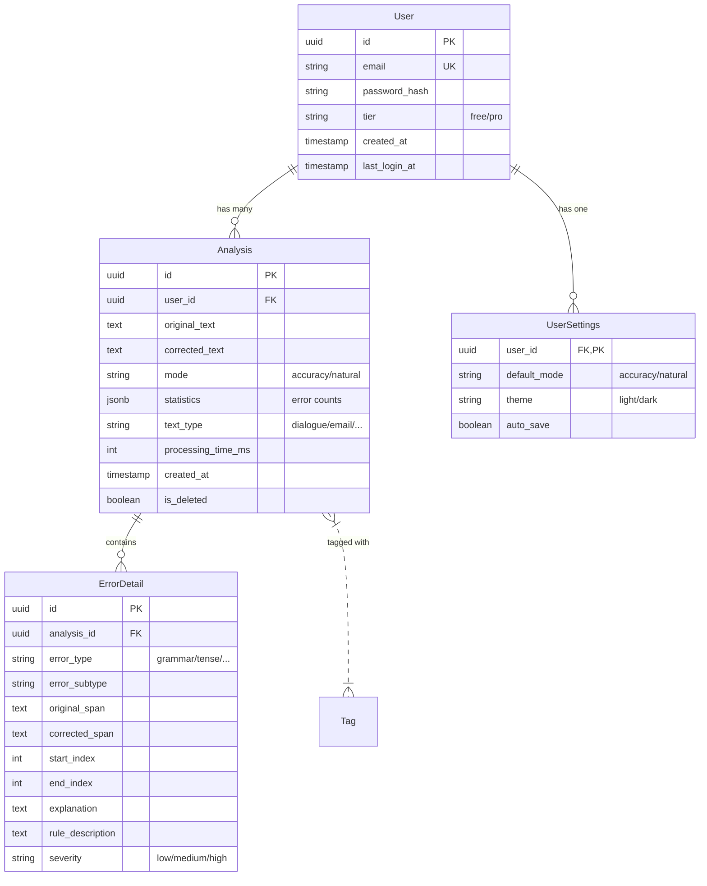
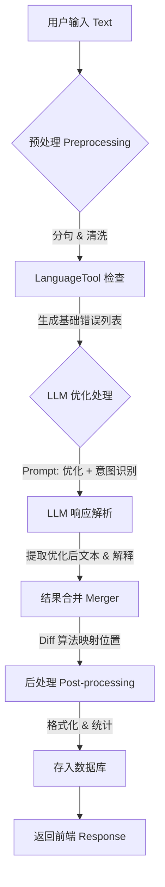

# English Transfer Assistant - 详细开发实施规范

**文档版本**: v1.0
**状态**: 待开发
**最后更新**: 2026-01-20

本文档旨在提供**代码级**的开发指导，涵盖数据库设计、API 接口定义、核心业务流程及关键算法逻辑。开发人员应直接依据本文档进行编码。

---

## 1. 数据库设计 (Database Schema)

### 1.1 ER 图 (Entity-Relationship Diagram)



### 1.2 SQLAlchemy 模型定义 (Draft)

#### `models/user.py`
```python
from sqlalchemy import Column, String, DateTime, Boolean, ForeignKey
from sqlalchemy.dialects.postgresql import UUID
from sqlalchemy.orm import relationship
from datetime import datetime
import uuid
from .base import Base

class User(Base):
    __tablename__ = "users"

    id = Column(UUID(as_uuid=True), primary_key=True, default=uuid.uuid4)
    email = Column(String, unique=True, index=True, nullable=False)
    password_hash = Column(String, nullable=False)
    tier = Column(String, default="free")  # free, pro
    created_at = Column(DateTime, default=datetime.utcnow)
    last_login_at = Column(DateTime, nullable=True)
    is_active = Column(Boolean, default=True)

    # Relationships
    analyses = relationship("Analysis", back_populates="user", cascade="all, delete-orphan")
    settings = relationship("UserSettings", back_populates="user", uselist=False, cascade="all, delete-orphan")

class UserSettings(Base):
    __tablename__ = "user_settings"

    user_id = Column(UUID(as_uuid=True), ForeignKey("users.id"), primary_key=True)
    default_mode = Column(String, default="accuracy")
    theme = Column(String, default="light")
    auto_save = Column(Boolean, default=True)

    user = relationship("User", back_populates="settings")
```

#### `models/analysis.py`
```python
from sqlalchemy import Column, String, Text, Integer, DateTime, Boolean, ForeignKey, JSON
from sqlalchemy.dialects.postgresql import UUID
from sqlalchemy.orm import relationship
from datetime import datetime
import uuid
from .base import Base

class Analysis(Base):
    __tablename__ = "analyses"

    id = Column(UUID(as_uuid=True), primary_key=True, default=uuid.uuid4)
    user_id = Column(UUID(as_uuid=True), ForeignKey("users.id"), nullable=True, index=True) # Nullable for anonymous (if stored)
    
    original_text = Column(Text, nullable=False)
    corrected_text = Column(Text, nullable=False)
    mode = Column(String, nullable=False)  # accuracy, natural
    text_type = Column(String, default="unknown") # dialogue, email, essay
    
    # 存储统计摘要，避免频繁 join 查询
    # 格式: {"total": 5, "grammar": 2, "tense": 3}
    statistics = Column(JSON, default=dict) 
    
    processing_time_ms = Column(Integer, default=0)
    created_at = Column(DateTime, default=datetime.utcnow, index=True)
    is_deleted = Column(Boolean, default=False)

    # Relationships
    errors = relationship("ErrorDetail", back_populates="analysis", cascade="all, delete-orphan")
    user = relationship("User", back_populates="analyses")

class ErrorDetail(Base):
    __tablename__ = "error_details"

    id = Column(UUID(as_uuid=True), primary_key=True, default=uuid.uuid4)
    analysis_id = Column(UUID(as_uuid=True), ForeignKey("analyses.id"), nullable=False, index=True)
    
    error_type = Column(String, nullable=False) # grammar, tense, word_choice, mixed_language
    error_subtype = Column(String) # past_tense, subject_verb_agreement
    
    original_span = Column(String, nullable=False)
    corrected_span = Column(String, nullable=False)
    
    start_index = Column(Integer, nullable=False)
    end_index = Column(Integer, nullable=False)
    
    explanation = Column(Text)
    rule_description = Column(Text)
    severity = Column(String, default="medium") # low, medium, high

    analysis = relationship("Analysis", back_populates="errors")
```

---

## 2. API 接口规范 (API Specification)

所有接口前缀: `/api/v1`

### 2.1 认证模块 (Auth)

#### 注册 (Register)
*   **URL**: `POST /auth/register`
*   **Request**:
    ```json
    {
      "email": "user@example.com",
      "password": "StrongPassword123!"
    }
    ```
*   **Response (201)**:
    ```json
    {
      "access_token": "ey...",
      "token_type": "bearer",
      "user": {
        "id": "uuid",
        "email": "user@example.com",
        "tier": "free"
      }
    }
    ```

#### 登录 (Login)
*   **URL**: `POST /auth/login` (Content-Type: `application/x-www-form-urlencoded` - OAuth2 standard)
*   **Request**: `username=user@example.com&password=...`
*   **Response (200)**: 同注册。

#### 获取当前用户 (Get Me)
*   **URL**: `GET /auth/me`
*   **Headers**: `Authorization: Bearer <token>`
*   **Response (200)**: 用户详情 + 设置。

---

### 2.2 核心业务模块 (Core)

#### 分析文本 (Analyze)
这是系统的核心接口，包含完整的 Pipeline 处理。

*   **URL**: `POST /analyze`
*   **Headers**: `Authorization: Bearer <token>` (可选，匿名用户有限流)
*   **Request**:
    ```json
    {
      "text": "I go to school yesterday. And I very like it.",
      "mode": "accuracy", // "accuracy" | "natural"
      "options": {
        "detect_chinese": true,
        "preserve_proper_nouns": true
      }
    }
    ```
*   **Response (200)**:
    ```json
    {
      "id": "analysis_uuid",
      "original_text": "I go to school yesterday. And I very like it.",
      "corrected_text": "I went to school yesterday. And I really liked it.",
      "text_type": "sentence",
      "stats": {
        "total_errors": 2,
        "by_type": { "tense": 1, "chinglish": 1 }
      },
      "errors": [
        {
          "id": "err_001",
          "type": "tense",
          "subtype": "past_tense",
          "original": "go",
          "correction": "went",
          "position": { "start": 2, "end": 4 },
          "explanation": "过去发生的事情应该使用过去式。",
          "severity": "high"
        },
        {
          "id": "err_002",
          "type": "chinglish",
          "subtype": "literal_translation",
          "original": "very like",
          "correction": "really liked",
          "position": { "start": 26, "end": 35 },
          "explanation": "中文'很喜欢'通常翻译为 'really like' 而不是 'very like'。",
          "severity": "medium"
        }
      ],
      "learning_tips": [
        "注意区分一般过去时的动词变化 (go -> went)",
        "避免直译中文习惯用语 (very like -> really like)"
      ]
    }
    ```

#### 导出结果 (Export)
*   **URL**: `POST /export`
*   **Request**:
    ```json
    {
      "analysis_ids": ["uuid1", "uuid2"],
      "format": "markdown" // "markdown" | "pdf" | "json"
    }
    ```
*   **Response (200)**: 文件流 (Content-Disposition: attachment; filename="correction_notes.md")

---

### 2.3 历史与统计 (History & Stats)

#### 历史列表 (List History)
*   **URL**: `GET /history`
*   **Query Params**: `page=1&limit=20&mode=accuracy`
*   **Response (200)**: 分页列表。

#### 历史详情 (Get History Detail)
*   **URL**: `GET /history/{id}`
*   **Response (200)**: 完整的 Analysis 对象 (同 `/analyze` 响应)。

#### 删除历史 (Delete History)
*   **URL**: `DELETE /history/{id}`
*   **Response (204)**: No Content.

#### 统计概览 (Stats Overview)
*   **URL**: `GET /statistics/overview`
*   **Response (200)**:
    ```json
    {
      "total_analyses": 100,
      "total_errors": 350,
      "error_distribution": {
        "grammar": 40,
        "tense": 30,
        "word_choice": 20,
        "mixed_language": 10
      },
      "weekly_trend": [
        { "date": "2026-01-14", "errors": 10 },
        { "date": "2026-01-15", "errors": 5 }
      ]
    }
    ```

---

## 3. 核心功能内部逻辑 (Internal Logic)

### 3.1 文本分析流水线 (Analysis Pipeline)

流水线采用 **Chain of Responsibility** 模式或简单的 **Sequential Execution**。

**流程图**:


**详细步骤**:

1.  **预处理 (Preprocessor)**:
    *   输入: Raw Text
    *   操作:
        *   去除首尾空白。
        *   使用 `nltk` 或简单正则进行分句 (Sentences)。
        *   识别文本中是否包含中文 (Regex `[\u4e00-\u9fff]`)，若包含 > 50% 且无英文，直接报错 "Invalid Language"。
    *   输出: Cleaned Text, Sentence List.

2.  **规则检查 (Rule Engine - LanguageTool)**:
    *   输入: Sentence List
    *   操作: 并行调用 `language-tool-python`。
    *   输出: `List[LTError]` (start, end, ruleId, message, replacements)。
    *   *映射逻辑*: 将 LT 的 `ruleId` 映射到系统定义的 `error_type` (如 `VERB_TENSE` -> `tense`)。

3.  **LLM 优化 (LLM Engine - ZhipuAI)**:
    *   输入: Cleaned Text, Mode (Accuracy/Natural)
    *   **Prompt 设计 (核心)**:
        ```text
        You are an English writing assistant.
        Task: Correct and improve the following text.
        Mode: {mode} (Accuracy: fix errors only; Natural: improve flow and nativeness).
        Input Text:
        """{text}"""
        
        Requirements:
        1. Return a JSON object.
        2. Field 'corrected_text': The full corrected text.
        3. Field 'changes': Array of changes, each with 'original', 'corrected', 'explanation', 'type'.
        4. Field 'text_type': Identify if it's dialogue, email, etc.
        ```
    *   输出: JSON with `corrected_text` and `changes` (Semantic errors).

4.  **结果合并 (Merger)**:
    *   **难点**: 规则引擎基于 *原文位置*，LLM 可能会 *重写整句* 导致位置丢失。
    *   **策略**:
        *   若 Mode == Accuracy: 以 **规则引擎** 结果为主，LLM 仅用于补充解释和检测复杂逻辑错误。
        *   若 Mode == Natural: 以 **LLM 重写结果** 为主。使用 `diff-match-patch` 算法对比 `original` 和 `corrected`，计算出差异片段的 `start/end` 索引。
    *   **Diff 算法**:
        *   使用 Google 的 `diff-match-patch` 库。
        *   Diff 生成 `(DELETE, "go"), (INSERT, "went")`。
        *   将 Diff 转换为 ErrorDetail 对象。

### 3.2 导出功能逻辑 (Export Service)

1.  **数据获取**: 根据 ID 列表从 DB 拉取 Analysis 数据。
2.  **格式转换**:
    *   **Markdown**: 使用 Jinja2 模板渲染。
        ```markdown
        # Correction Note - {{ date }}
        
        ## Original
        {{ original }}
        
        ## Corrected
        {{ corrected }}
        
        ## Key Errors
        
        - **{{ err.original }}** -> **{{ err.corrected }}**: {{ err.explanation }}
        
        ```
    *   **JSON**: 直接 dump。
    *   **PDF**: 使用 `WeasyPrint` 或 `ReportLab`，先渲染 HTML 再转 PDF。

---

## 4. 重点功能流程细节

### 4.1 错误高亮与交互 (Frontend-Backend Contract)

前端需要精确的 `start_index` 和 `end_index` 来渲染高亮。

*   **后端责任**: 确保返回的 `position: {start, end}` 是基于 `original_text` 的字符索引（0-based）。
*   **前端实现**:
    *   使用 `computed` 属性将 `original_text` 切片：`[0:start]`, `<span class="error">match</span>`, `[end:]`。
    *   处理 **重叠错误** (Overlap): 如果两个错误位置重叠（如 "very like" 和 "like"），优先显示范围更大的错误，或者合并显示。后端应在 `Merger` 阶段消除重叠，确保返回的错误列表无索引冲突。

### 4.2 统计数据聚合 (Statistics Aggregation)

为了性能，统计数据不应每次实时 `count(*)`。

*   **写入时**: 每次 Analysis 完成入库时，解析 `error_details`，计算各类错误数量，存入 `Analysis.statistics` 字段 (JSON)。
*   **查询时**:
    *   总错误数: `SUM((statistics->>'total_errors')::int)`
    *   类型分布: SQL 聚合查询 `analyses` 表的 JSON 字段。
    *   *优化*: 如果数据量 > 10万，引入 `user_statistics_daily` 汇总表，每日定时任务更新。MVP 阶段直接查 `analyses` 表即可。

---

## 5. 开发检查清单 (Development Checklist)

### Phase 1: 基础设施
- [ ] 初始化 FastAPI + Poetry + Postgres (Docker)。
- [ ] 实现 User Model 和 Auth API (JWT)。
- [ ] 搭建 Logging 和 Error Handling 中间件。

### Phase 2: 核心流水线
- [ ] 集成 LanguageTool (Python wrapper)。
- [ ] 集成 ZhipuAI SDK。
- [ ] 实现 `AnalysisService.analyze` 方法 (Pipeline)。
- [ ] 实现 Diff 算法与位置映射逻辑。
- [ ] 完成 `/analyze` 接口。

### Phase 3: 业务功能
- [ ] 实现 History CRUD 接口。
- [ ] 实现 Statistics 聚合接口。
- [ ] 实现 Export 模板渲染。

### Phase 4: 测试与优化
- [ ] 编写 Pipeline 单元测试 (Mock LLM)。
- [ ] 编写 API 集成测试。
- [ ] 压测 Pipeline 响应时间，优化 Prompt。
